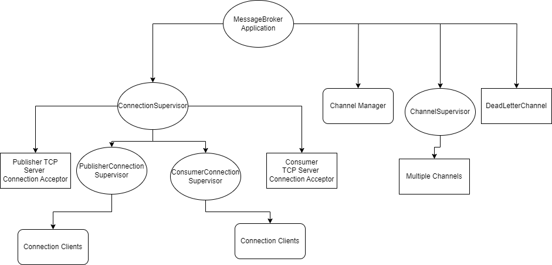
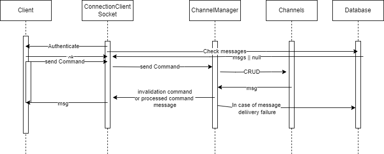

# FAF.PTR16.1 -- Project 2
> **Performed by:** Nicolae Gherman, group FAF-202
> **Verified by:** asist. univ. Alexandru Osadcenco


## Overall Arhitecture and Message Flow:  







## Overall Solution 

# The starting point is MessageBroker.ex. Overall supervision tree looks like: 

``` 
 def start(_type,_args) do
    children = [
          %{
            id: :TcpServerConnectionPoolSupervisor,
            start: {ConnectionSupervisor, :start,  [] },
            type: :supervisor
          },
          %{
            id: :ChannelSupervisor,
            start: {ChannelSupervisor, :start,  [] },
            type: :supervisor
          },
          %{
            id: :ChannelManager,
            start: {ChannelManager, :start,  [] },
            type: :worker
          },
          %{
            id: :DeadLetterChannel,
            start: {DeadLetterChannel, :start,  [] },
            type: :worker
          },
      ]
    opts = [strategy: :one_for_one]
    Supervisor.start_link(children, opts)
  end
 
```  

# Let's dive into how the ConnectionSupervisor work!

```
  def start() do
    cmd1 = ["GET", "CREATE", "PUBLISH"]
    cmd2 = ["GET", "SUBSCRIBE","UNSUBSCRIBE"]
    children =
      [
      {Task.Supervisor, name: PublisherConnectionsSupervisor},
      {Task.Supervisor, name: ConsumerConnectionsSupervisor},
      Supervisor.child_spec({Task, fn -> TcpServer.accept(6000,PublisherConnectionsSupervisor,cmd1) end}, restart: :permanent, id: :PublisherServer ),
      Supervisor.child_spec({Task, fn -> TcpServer.accept(6001,ConsumerConnectionsSupervisor,cmd2) end}, restart: :permanent, id: :ConsumerServer)
      ]
    Supervisor.start_link(__MODULE__, children, name: __MODULE__)
  end

```

So we spawn here another 2 supervisors which are responsible for accepting connections on sockets. The first is for the Publisher, the other one is for  Consumer.
We also pass initial commands array to the TcpServer Modules to make an initial check on commands depending on the connection port (Publisher or Subscriber.)

# What exactly these TcpServers do?

```
  def accept(port, conSupervisor,cmds) do
    {:ok, socket} =
      :gen_tcp.listen(port, [:binary, packet: :line, active: false, reuseaddr: true])
    Logger.info("Accepting connections on port #{port}")
    loop_acceptor(socket, conSupervisor,cmds)
  end

  defp loop_acceptor(socket, conSupervisor,cmds) do
    {:ok, client} = :gen_tcp.accept(socket)
    {:ok, pid} = Task.Supervisor.start_child(conSupervisor, fn -> ConnectionClient.authenticate(client,cmds) end)
    :ok = :gen_tcp.controlling_process(client, pid)
    loop_acceptor(socket, conSupervisor,cmds)
  end

```  

They are defined to listen to ports and redirect to the Supervisors from ConnectionSupervisor the telnet connections. As we can see the ConnectionClient have to authenticate first.
This helps to keep the durables queues to keep messages meant to be sent to a  client that had a dropped connection.


# ConnectionClient
``` 
  def authenticate(socket,cmds) do
      :gen_tcp.send(socket,"Please introduce yourself:\r\n>" )
      {status, data } = :gen_tcp.recv(socket,0)
      cond do
        status == :ok ->
          validate_auth_input(socket,cmds,data)
          |> serve(socket,cmds)
        status == :error -> IO.inspect("lost connection")
      end
   end

   def validate_auth_input(socket, cmds, str) do
    splitted =  String.split(str)
    if length(splitted) != 3 do
      :gen_tcp.send(socket,"Smth wong...\r\n>" )
      authenticate(socket,cmds)
    end
    [h|t ] = splitted
    if h != "I" do
      :gen_tcp.send(socket,"Smth wong...\r\n>" )
      authenticate(socket,cmds)
    end
    [h | t] = t
    if h != "AM" do
      :gen_tcp.send(socket,"Smth wong...\r\n>" )
      authenticate(socket,cmds)
    end
    [h | _] = t
    :gen_tcp.send(socket, "Welcome " <> h <> "! \r\n>" )
    {:ok,pid} = Database.start_link
    kek = Tds.query!(pid, "SELECT * FROM messages WHERE name = '#{h}'",[])
    cond do
      length(kek.rows) > 0 ->
        :gen_tcp.send(socket, "Heres msgs for " )
        Enum.each(kek.rows, fn r ->
          :gen_tcp.send(socket, "\r\n" <> List.to_string(r) <> "\r\n")
        end  )
        Database.delete(h,pid)
      true ->h
    end
   end


    def serve(name,socket,cmds) do
      socket
      |> read_line()
      |> process_data(cmds,name)
      |> write_line(socket)
      check_queue(socket)
      serve(name,socket,cmds)
    end

    defp read_line(socket) do
      ...
    end

    defp write_line(line, socket) do
      :gen_tcp.send(socket, line)
    end

    defp check_queue(socket) do
      {_, nr} =  Process.info(self(), :message_queue_len)
      cond do
        nr > 0 -> read_publisher_messages(nr,socket)
        true -> :ok
      end
    end

    defp read_publisher_messages(nr,socket) do
      ...
    end

    defp process_data(data,cmds,name) do
     splitted = String.split(data)
     b = Enum.member?(cmds,elem(List.to_tuple(splitted),0))
     cond do
      b == true ->
        send(ChannelManager,{data,self(),name});
        receive do
          msg -> msg
        after
          3000 -> send(DeadLetterChannel, data)
        end
      true -> "wrong command!\r\n>"
     end
    end

```

As we can see, first on authentication it checks the Database for any messages. Some of the databse queries can be found in db.ex. Further it just reads lines, write back, process the commands and if it succesful it sends further to the ChannelManager and waits for a response. If the response doesnt reach it, it goes to the DeadLetterChannel. 
Also we have the check_queue() which is responsible for checking the messages which are published to the consumer specifically.


# Channel Manager

``` 

  def handle_info({cmd, pid, pidAuthName} , state) do
    state = Map.put(state,pid,pidAuthName)
    splitted = String.split(cmd)
    [whichCmd|t] =  splitted
    cond do
      whichCmd == "CREATE" ->
        parse_CREATE(t,pid)
        {:noreply, state}
      whichCmd == "GET" ->
        parse_GET(pid)
        {:noreply, state}
      whichCmd == "PUBLISH" ->
        parse_PUBLISH(t,pid,state)
        {:noreply, state}
      whichCmd == "SUBSCRIBE" ->
        parse_SUBSCRIBE(t,pid)
        {:noreply, state}
      whichCmd == "UNSUBSCRIBE" ->
        parse_UNSUBSCRIBE(t,pid)
        {:noreply, state}
      true ->   {:noreply, state}
    end
  end

  defp parse_CREATE([channelName],pid) do
    Supervisor.start_child( ChannelSupervisor,
      %{
        id: String.to_atom(channelName),
        start: {Channel, :start,  [String.to_atom(channelName)] },
        type: :worker
      })
      send(pid, "created\r\n\n>")
  end

  defp parse_PUBLISH(t,pid,state) do
    [chnl | msg] = t
    cond do
      containsChannel(chnl) == true ->
             send(pid, publish_messages_to_cosumers(chnl, msg,state))
      true -> send(pid,"Channel 404\r\n>")
    end
  end

  defp publish_messages_to_cosumers(chnl,msg,state) do
     GenServer.call(String.to_atom(chnl), {:update,msg})
     subs = GenServer.call(String.to_atom(chnl), :get_subscribers)
     cond do
      length(subs) > 0 ->
         strMsg = Enum.reduce(msg, "", fn x,acc -> acc <> " "  <> x end )
         fnMsg = "\r\n The message from channel "  <> chnl <> ":\r\n" <> strMsg <> "\r\n"
         reached = Enum.reduce(subs, 0, fn sub,acc -> acc +
          cond do
            Process.alive?(sub) == true ->
              send(sub, fnMsg)
              1
            true ->
              {:ok,pid} = Database.start_link
              kek = Database.toMap([Map.get(state, sub), fnMsg ])
              Database.post(kek, pid)
              0
          end
        end)
       "Reached out " <> Integer.to_string(reached) <> " out of " <> Integer.to_string(length(subs)) <> "\r\n>"
      true -> "0 subscribers\r\n>"
     end
  end


  defp parse_SUBSCRIBE([channelName],pid) do
    ...
  end

  defp parse_UNSUBSCRIBE([channelName],pid) do
    ...
  end

  defp parse_GET(to_pid) do
    ...
  end

  defp  containsChannel(chnl) do
    Enum.reduce(Supervisor.which_children(ChannelSupervisor), [], fn x,acc -> {name,_,_,_} = x;  acc ++ [name] end )
    |> Enum.member?(String.to_atom(chnl))
  end
```

Here all the logic happens on validations and message processing. Also, we can observe that the Channel Manage spawns Channels/Topics in case of creation command from Publisher.
It spawns the Channel under the supervision of ChanngerSupervisor. It also keeps updating and adding new connections PIDs to the state map in order to know who are the clients, storing information into Database in case of failed messaged delivery. It also informs the Publisher how many consumers have reached the message.


# The Channel

``` 

  def init(state) do
    state = Map.put(state, "messages",[])
    state = Map.put(state, "subscribers",[])
    {:ok, state}
  end
  def handle_call({:update, msg}, _from, state) do
    strMsg = Enum.reduce(msg, "", fn x,acc -> acc <> " "  <> x end )
    state = Map.update!(state, "messages", &(&1 ++ [[strMsg]]))
    {:reply,"message received to Broker\r\n>", state}
  end

  def handle_call({:subscribe, client}, _from, state) do
    state = Map.update!(state, "subscribers", &(&1 ++ [client]))
    IO.inspect(state)
    {:reply,"subscribed\r\n>", state}
  end

  def handle_call({:unsubscribe, client}, _from, state) do
    newSubs =
    Map.get(state, "subscribers")
    |> Enum.filter(fn x -> x != client end)
    state = Map.replace(state,"subscribers", newSubs)
    IO.inspect(state)
    {:reply,"usubscribed\r\n>", state}
  end

  def handle_call(:get_subscribers, _from, state) do
    subs = Map.get(state, "subscribers")
    {:reply,subs, state}
  end

``` 
As a state, the Channel keeps the messages and the subscribers. Further, it hust handles commands from Publisher and Subsribers.


## Conclusion 
1. The lab have been a great opportunity to implement MB arhitecture and play around with the details of it.
2. A great opportunity to study the Kafka && RabitMQ arhitecture details and grasp  strong knowledge of the importance of message stream apps including persistence of messages, durable queues.
3. You have to study and make a careful arhitecture in order to promote fault tolerance and prohib data loss. 
